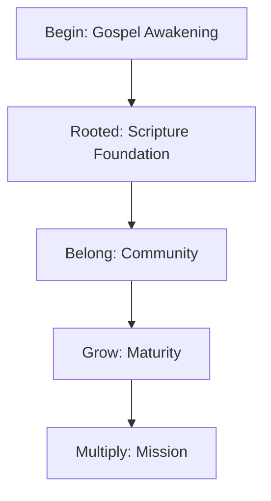

## Overview

The Discipleship Journey forms the heart of The Great Awakening. You progress through stages designed to deepen your faith, rooted in Scripture and centered on Jesus. This journey emphasizes grace over performance, community for support, and mission to multiply your impact.

Key principles guide you:
- Grace-driven living frees you from guilt.
- Identity in Christ anchors your assurance.
- Spiritual disciplines build steady growth.
- Community prevents isolation.
- Mission equips you to disciple others.

<Callout kind="info">
Focus on one stage at a time. Progress comes through consistent, Scripture-centered steps.
</Callout>

## Core Biblical Concepts

Explore the foundational ideas that shape your journey.

<Columns cols={2}>
  <Card title="Grace Over Guilt" icon="shield">
    Embrace God's unearned favor. Live from acceptance, not striving for it.
  </Card>
  <Card title="Identity in Christ" icon="users">
    You are a beloved child of God. This truth transforms how you see yourself and others.
  </Card>
  <Card title="Community Belonging" icon="heart">
    Faith thrives in relationship. Connect with others for accountability and encouragement.
  </Card>
  <Card title="Mission Multiplication" icon="zap">
    Grow to give. Equip yourself to lead and disciple those around you.
  </Card>
</Columns>

## The Discipleship Journey Flow

Visualize your path through the stages.



## Stages of the Journey

Each stage builds on the last. Dive into specifics.

<Tabs>
  <Tab title="Begin" icon="play-circle">
    Awake to the Gospel. Understand salvation through faith in Jesus.
    
    Key questions:
    - What is the Gospel?
    - How do you respond in repentance and trust?
    
    <Callout kind="tip">
      Start here if you're exploring faith.
    </Callout>
  </Tab>
  <Tab title="Rooted" icon="book-open">
    Build foundations in Scripture, identity, and grace.
    
    Focus on daily Bible reading and prayer to steady your walk.
  </Tab>
  <Tab title="Belong" icon="users">
    Join a community. Share struggles and victories.
    
    Find a group at [thegreatawakening.com/belong](https://thegreatawakening.com/belong).
  </Tab>
  <Tab title="Grow" icon="trending-up">
    Mature in obedience and grace-driven decisions.
    
    Develop disciplines like fasting and service.
  </Tab>
  <Tab title="Multiply" icon="rocket">
    Disciple others. Live on mission.
    
    Mentor someone in an earlier stage.
  </Tab>
</Tabs>

## Building Spiritual Disciplines

Establish habits that sustain growth.

<Steps>
  <Step title="Daily Scripture" icon="book-open">
    
    Read one chapter. Reflect: What does this reveal about Jesus?
    
````markdown
```bash
# Example routine
Morning: Psalm + Gospel reading
Journal: One truth, one prayer
```
````
    
  </Step>
  <Step title="Prayer Practice" icon="pray">
    
    Spend 10 minutes in gratitude and confession.
    
    Use the Lord's Prayer as a guide.
  </Step>
  <Step title="Community Check-in" icon="message-circle">
    
    Share weekly with a partner. Ask: How did grace show up?
  </Step>
  <Step title="Serve Others" icon="hand-heart">
    
    Apply learning through action. Volunteer or encourage someone.
  </Step>
</Steps>

## Transitioning Between Stages

Know when to move forward.

<ExpandableGroup>
  <Expandable title="Signs You're Ready for the Next Stage" default-open="true">
    
    | Stage Transition | Key Indicators |
    |------------------|----------------|
    | Begin to Rooted | Confident in salvation; eager for Bible study |
    | Rooted to Belong | Understands identity; seeks accountability |
    | Belong to Grow | Consistent disciplines; leads discussions |
    | Grow to Multiply | Disciples others naturally; lives missionally |
    
    Pray and seek mentor feedback before advancing.
  </Expandable>
  <Expandable title="Common Challenges">
    
    - Doubt during transitions: Revisit grace truths.
    - Isolation: Re-engage community.
    - Stagnation: Review disciplines with a partner.
    
    <Callout kind="alert">
      Transitions take time. Grace covers imperfect progress.
    </Callout>
  </Expandable>
</ExpandableGroup>

## Next Steps

Apply these concepts today. Begin with the [Begin stage](/begin) or review your current position. Your journey awaits—steady, Scripture-centered growth lies ahead.